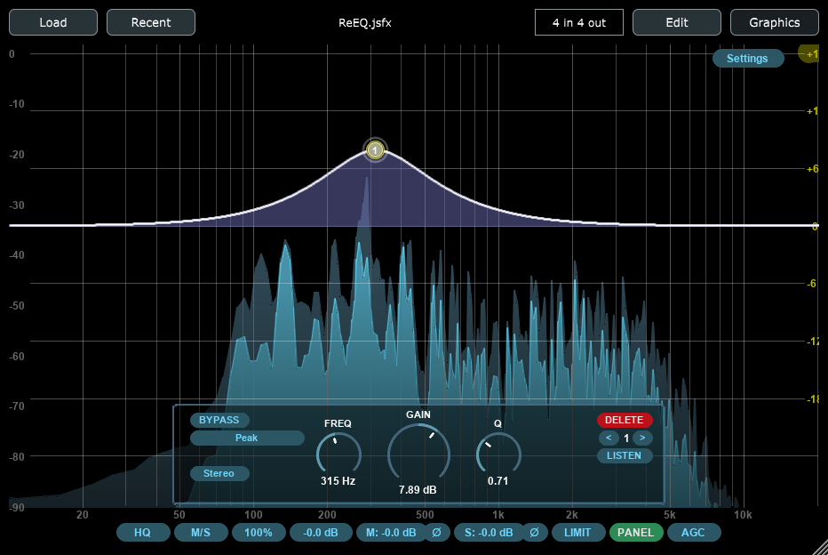

# ysfx

Hosting library and audio plugin for JSFX



## Description

This package provides support for audio and MIDI effects developed with the JSFX
language. These effects exist in source code form, and they are compiled and ran
natively by hosting software.

This contains a hosting library, providing a JSFX compiler and runtime.
In addition, there is an audio plugin which can act as a JSFX host in a digital
audio workstation.

Please note that this project is not the work of Cockos, Inc; however, it is
based on several free and open source components from the WDL. Originally, this
project was based on jsusfx by Pascal Gauthier, but then it became an entire
rewrite made from scratch.

## Building

To build the project, one must first set up a C++ development environment
equipped with Git and CMake. One can then build the library and the audio
plugin, by entering commands as follows:

```
git clone https://github.com/jpcima/ysfx.git
cd ysfx
git submodule update --init --recursive
mkdir build
cd build
cmake -DCMAKE_BUILD_TYPE=RelWithDebInfo ..
cmake --build .
```
